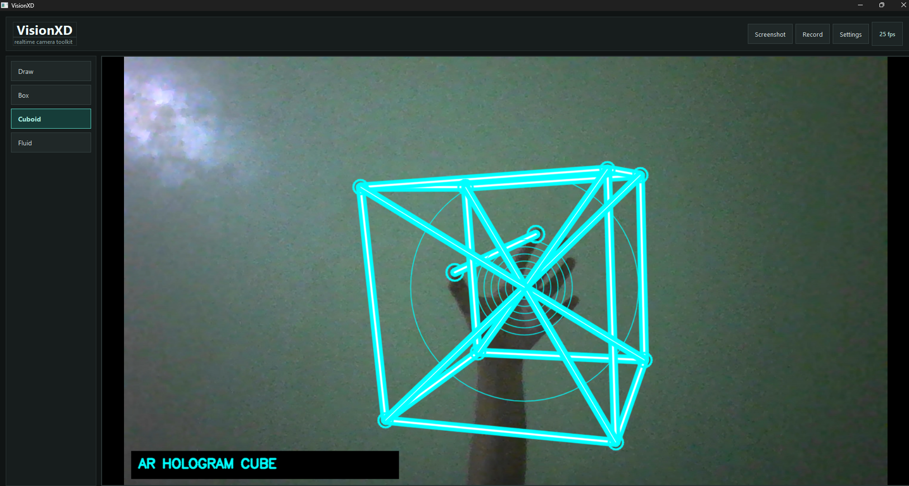

# VisionxD

VisionxD is an experimental computer vision application built using OpenCV, MediaPipe and PySide6 in python. Here different visual effects, gestures can be used live through a webcam.


## Motivation

I came across a cool reel with some crazy visual gesture effects and wanted to recreate it. When looking into it, I found out it was made using TouchDesigner which was wildly difficult to learn. So instead, I just decided to code everything in python from the ground up whilst also learning in the process.

## Features

- Realtime camera effects
- Hand tracking using MediaPipe
- Gestures interaction
- Hologram controller
- Air drawing system
- Video recording and screenshots
- Dark and Light theme
- Desktop UI

---

## Screenshots



---

## Tech Stack

- Python
- OpenCV
- MediaPipe
- NumPy
- PySide6

---

## Project Structure

```text
visionxd
├── README.md
├── assets
├── camera.py
├── core
│   └── utils.py
├── effects
│   ├── __init__.py
│   ├── box.py
│   ├── cuboid.py
│   ├── draw.py
│   └── fluid.py
├── main.py
├── requirements.txt
└── ui.py
```

---

## Running Locally

Clone the repository:

```bash
git clone https://github.com/yourname/visionxd.git
```

Install dependencies:

```bash
pip install -r requirements.txt
```

Run the app:

```bash
python main.py
```

---

## Windows Release

Download the latest `VisionXD-windows.zip` from the GitHub Releases page, unzip it, and run `VisionXD.exe`.

### System Requirements

- Windows 10 or Windows 11, 64-bit
- A webcam supported by Windows
- Camera access enabled in Windows privacy settings
- No separate Python install is required for the release build

### First Run Notes

- Windows SmartScreen may warn because the executable is unsigned. Choose "More info" and then "Run anyway" if you trust the GitHub Release download.
- If Windows blocks the downloaded zip or executable, right-click the zip file or `VisionXD.exe`, open Properties, check "Unblock", then apply the change.
- Allow camera access if Windows asks. VisionXD starts the camera when the app opens.
- Screenshots and recordings are saved in the `captures` folder by default.

---

## How It Works

OpenCV and MediaPipe is used for realtime hand tracking and camera input. Then desktop UI is built using PySide6.

Visual effects are separated into its own files and there's seperate modular structure for the camera and UI.

---

## AI Usage

ChatGPT was occasionally used for debugging, helping with effect simulation logic, performance optimization, and UI.
All final integrations, project structure, visual design decisions and implementations were done by me.
